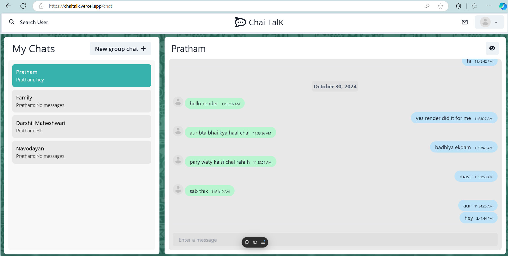
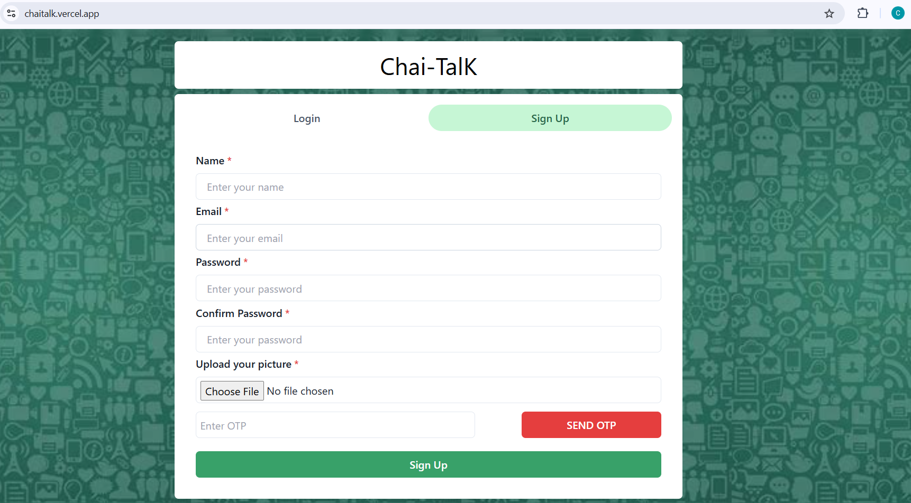
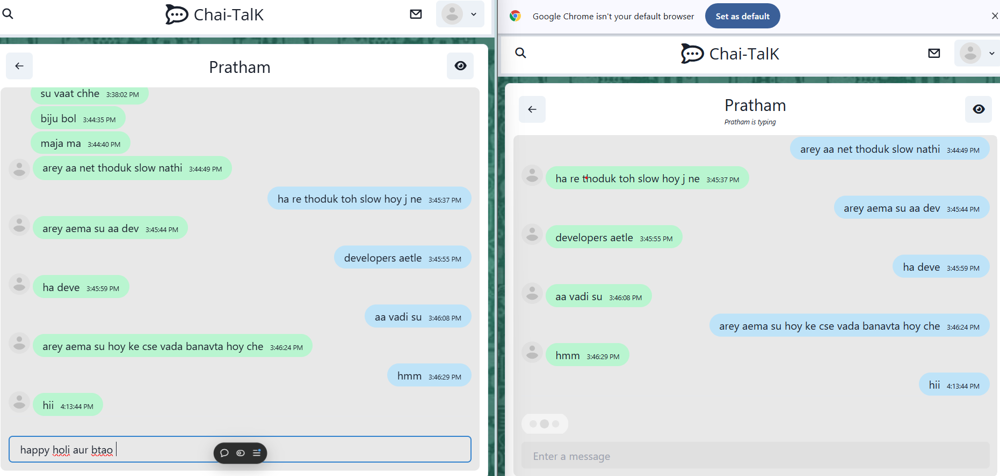
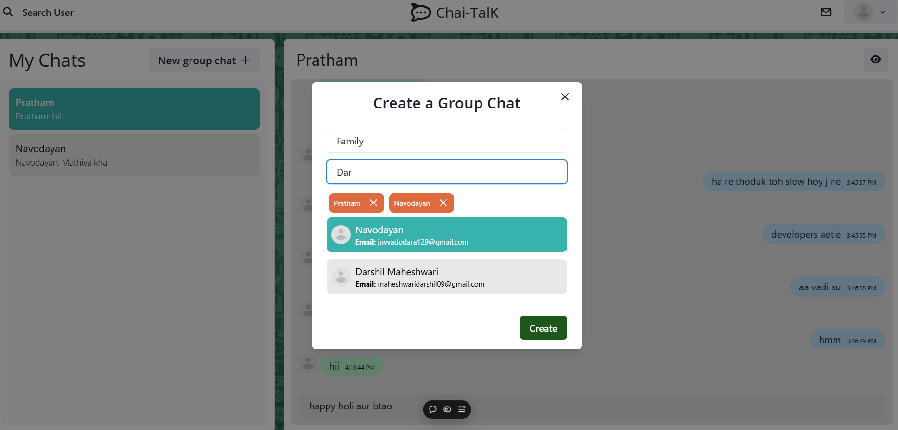
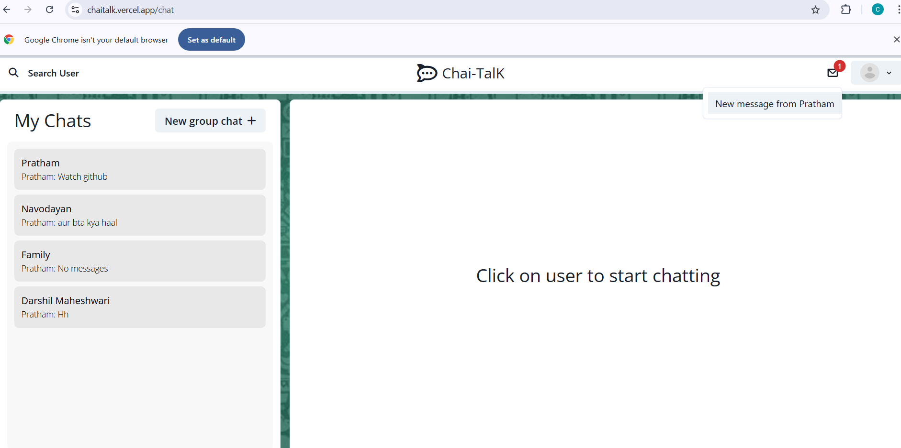

# Chai-TalK
Chai-TalK is a real-time chat application designed to facilitate secure and engaging communication.

Uses Socket.io for real time communication and stores user details in encrypted format in Mongo DB Database.


## Tech Stack

**Client:** ReactJs

**Server:** Node Js, Express

**Database**: MongoDB


## Demo

https://chaitalk.vercel.app/



## Run Locally

Clone the project

```bash
  git clone https://github.com/Pratham597/Chai-TalK.git
```

Go to the project directory

```bash
  cd Chai-TalK
```

Install dependencies
```bash
  cd backend
```

```bash
  npm install
```

```bash
  cd frontend
```

```bash
  npm install
```

Start the server

```bash
  npm run start
```

Start the client

```bash
  npm run dev
```

## Features

- Authentication: Email Verification via OTP.

    

- Real Time Chatting
  
    

- One-To-One Chats
    
- Create Group Chats
    
- Notifications
  


## Authors

- [@Pratham](https://www.github.com/Pratham597)